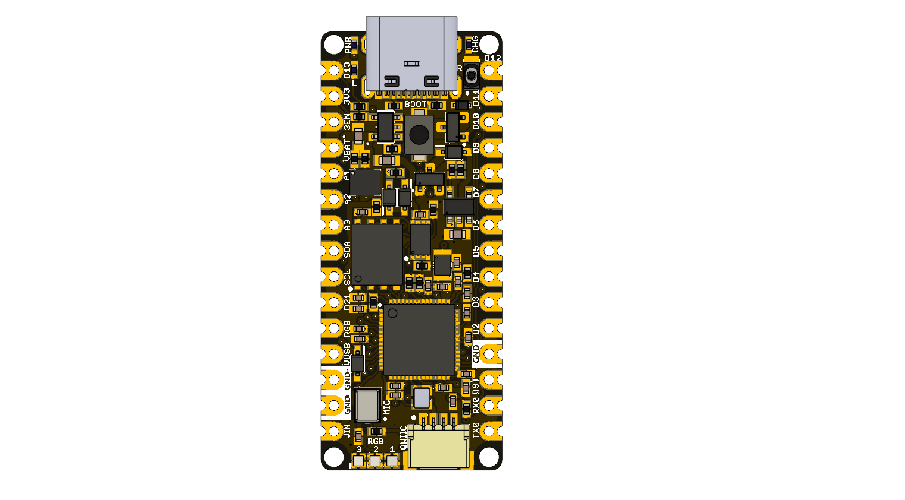

# UNIT PULSAR ESP32C5 Development Board

The UNIT PULSAR ESP32C5 is a multi-interface development board in the UNIT
DevLab ecosystem, based on the Espressif ESP32-C5HR8 microcontroller with
8 MiB of in-package PSRAM. The hardware integrates external QSPI flash,
environmental and magnetic sensing, microSD storage, an addressable RGB
indicator, USB-C, QWIIC I²C, Li-ion battery charging with fuel gauge, and an
RF coaxial antenna connector. It supports 2.4 and 5 GHz dual-band Wi-Fi 6,
Bluetooth LE 5, Zigbee 3.0 and Thread 1.4.

  
  
<em>UNIT PULSAR RP2350 Development Board</em>

### Quick Setup

## Overview

| Feature | Description |
|---|---|
| Microcontroller | ESP32-C5HR8 RISC-V SoC, dual-band Wi-Fi 6, Bluetooth LE 5, 802.15.4 |
| Program Memory | BY25Q64ES 64 Mbit (8 MiB) QSPI NOR flash |
| External Memory | 8 MiB PSRAM integrated in the ESP32-C5HR8 package |
| Sensors | LPS22HB pressure, FHT40 humidity/temperature, VCNL4040 proximity/light, MMC5603NJ magnetometer |
| Power | BQ24074 Li-ion charger, MAX17048 fuel gauge, SGM6029 buck regulator |
| Storage | 47309-2651 microSD holder |
| Indicators | One WS2812 1010 RGB LED, user LED, power LED, and charge LED |
| Connections | USB-C, QWIIC I²C, battery (PH 2.0), 6-pin SH 1 mm, RF coaxial antenna, and edge pads |
| Hardware Revision | Unspecified |

## Applications

- **Firmware Development:** ESP32-C5 application and peripheral prototyping.
- **IoT Connectivity:** Dual-band Wi-Fi 6, Bluetooth LE, Zigbee and Thread nodes.
- **Environmental Monitoring:** Pressure, humidity, temperature, and light logging with microSD storage.
- **Battery-Powered Devices:** Portable prototypes with Li-ion charging and fuel gauging.
- **Education:** Digital I/O, ADC, I²C, SPI, wireless, and RISC-V learning.

## Resources

- [Schematic Diagram](https://github.com/UNIT-Electronics-MX/unit_pulsar_rp2350a/blob/main/hardware/unit_sch_v_1_3_0_pulsar_rp2350a.pdf)
- [Pinout Diagram](https://github.com/UNIT-Electronics-MX/unit_pulsar_rp2350a/blob/main/hardware/README.md#pinout)
- [Getting Started Guide](https://github.com/UNIT-Electronics-MX/unit_pulsar_rp2350a/wiki/0-Getting-Started)
- [C++ Examples](https://github.com/UNIT-Electronics-MX/unit_pulsar_rp2350a/tree/main/software/cpp_examples)

## 📝 License

All hardware and documentation in this project are licensed under the **MIT
License**. See the [repository license](https://github.com/UNIT-Electronics-MX/unit_pulsar_rp2350a/blob/main/LICENSE)
for details. Third-party reference files may have separate terms.

  Template created by UNIT Electronics

> **Documentation Note:**
> Electrical limits, mechanical dimensions, and connector orientation not
> defined by the V1.3 technical documentation are identified as unspecified.
> The board uses the RP2350A, while the schematic title block says
> `PULSAR RP230A` and revision `1.0.0`.
